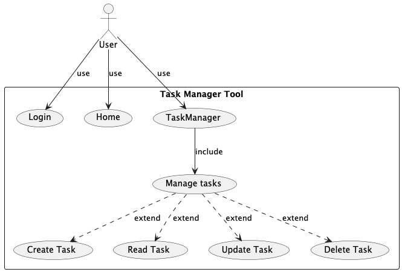
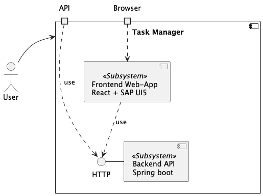
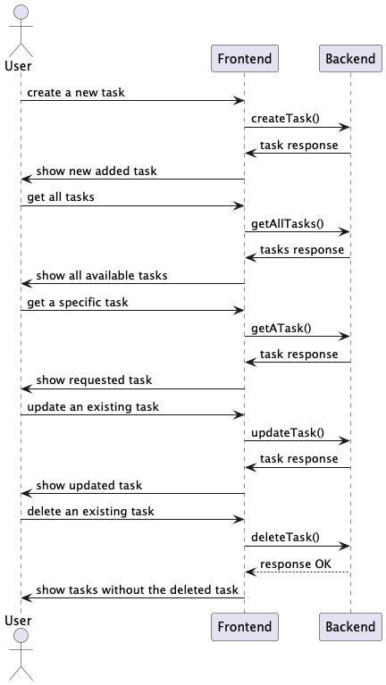

# Architecture Documentation

## 1️⃣ Overview
This document outlines the architecture for our **Task Management Tool**, highlighting the overall system
structure, key components, and rationale for early design decisions. The initial focus (Step 1) is to
understand the business domain and provide a minimal Proof of Concept (PoC) that demonstrates how the
core pieces fit together in a simple manner.

> **_Note_**:
> 
> **This document reflects the in progress work** and will be refined as new branches (steps) are introduced. In this
initial step, the main objective is simply having a minimally functional proof of concept that can
demonstrate the viability of the chosen tools and methodology.

### Summary of Business Domain
- Users need to manage tasks, e.g. users can create, edit, and delete tasks
- Each task has a title, description, creation date, and a finished date (if completed)
- Users must authenticate before managing tasks

### Initial PoC Goal
- Create a minimal running system with:
  1. A backend service to handle user authentication and task management.
  2. A frontend with basic create/read operations for tasks.
  
By focusing on this PoC, we can prove that our chosen frameworks (Spring Boot and React) and design
approach (modular architecture) are viable for future expansions.

<TBE> ... </TBE>

## 2️⃣ Architectural Decisions
1. We use a layered architecture approach to separate concerns (model, application/business
   logic, data).
2. We adopt session-based authentication for the PoC, knowing it might change later (e.g., JWT).
3. We use a simple relational database (H2 in-memory for PoC) to keep things lightweight but can
   switch to a persistent DB later (e.g., PostgreSQL, MariaDB, etc.).
4. We rely on standard tech choices:
   - for Backend: Spring Boot (for REST endpoints, dependency injection, etc.)
   - for Frontend: React, TypeScript, UI5 Web Components

<TBE> ... </TBE>

### Deferred Decisions
1. Database
   - To facilitate the PoC work, an H2 in-memory database is used. However, the database should
     be switched to a long-term persistent type to ensure the application operates productively.
2. Authentication
   - For now, we use session-based or very simple credentials. We will revisit if we need
     token-based OAuth2 for scaling.
3. Collaboration
   - We know tasks might eventually be shared by multiple users, but for now we only associate
     tasks with a single user. 
   - The design can be extended to support a “shared tasks” entity or a many-to-many relationship
     in the future.
4. Payment Models
   - The current MVP scope excludes payment. We leave placeholders in case the product transitions to
        a paid service.

## 3️⃣ System Design

### Building Block View

### Runtime View

### Backend Architecture
We have a Spring Boot application divided into the following 3-layers:
- REST Controllers (expose endpoints for tasks)
- Service Layer (business logic, e.g., create/edit tasks, handle authentication)
- Repository Layer (Data Access Layer, persistence with JPA) 

Furthermore, we have an infrastructure component that can configure the
framework-related modules, making it straightforward to spin up and test the app,
e.g., configuration for the authentication, database, etc.

<TBE> ... </TBE>

### Frontend Architecture
We use React and TypeScript for a modular, component-based approach:

- "Login" Component:
    - minimal functionality for username/password submission
- "Home" Component:
  - displays all user's available tasks 
- "Task Manager" Component:
  - contains the CRUD-Operation on tasks
    - fetch the user's tasks and display them
    - create a new task and display it
    - edit an existing task and display it
    - delete existing task and display new task list
- Use of UI5 Web Components

<TBE> ... </TBE>

## 4️⃣ Design Patterns & Best Practices
1. Layered Architecture
   - Separate controllers, services, and repositories
2. DTOs (Data Transfer Objects)
   - We use DTOs for request/response isolation
3. Entities (Data Access Objects)
   - We use DAOs for persistent of entities into the database
4. Modularized components
   -  Modularize components, which can be re-used

<TBE> ... </TBE>

## 5️⃣ Scalability
- The PoC runs on a single server with an in-memory DB, suitable for demonstration.
- <TBE> ... </TBE>

## 6️⃣ Security Considerations
- <TBE> ... </TBE>

## 7️⃣ Future Improvements
- Basic user/password system with session-based authentication.
- Passwords stored in the database are hashed (BCrypt or similar).
- Introduce a persistent database (PostgreSQL, MySQL) and robust migration strategy.
- Extend security to adopt industry-standard authentication/authorization (OAuth2, SAML, etc.).
- Integrate CI/CD pipelines for automated testing, containerization, and smooth rollouts.
- <TBE> ... </TBE>

## 8 CICD related
Please refer to this document [CICD.md](CICD.md)
---
🚀 **End of Document**