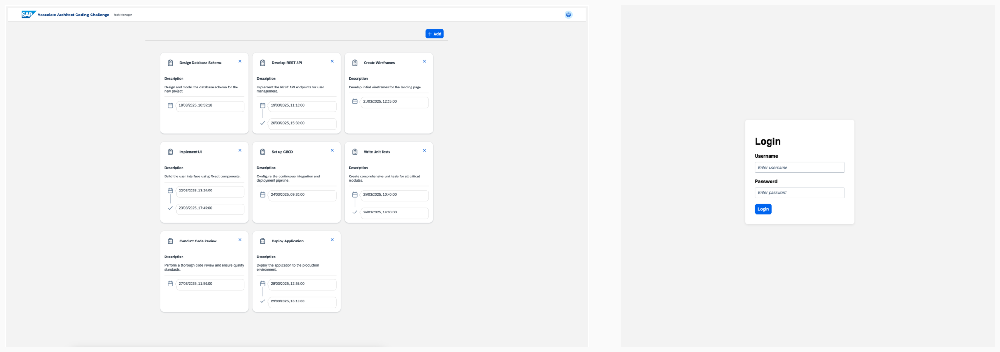
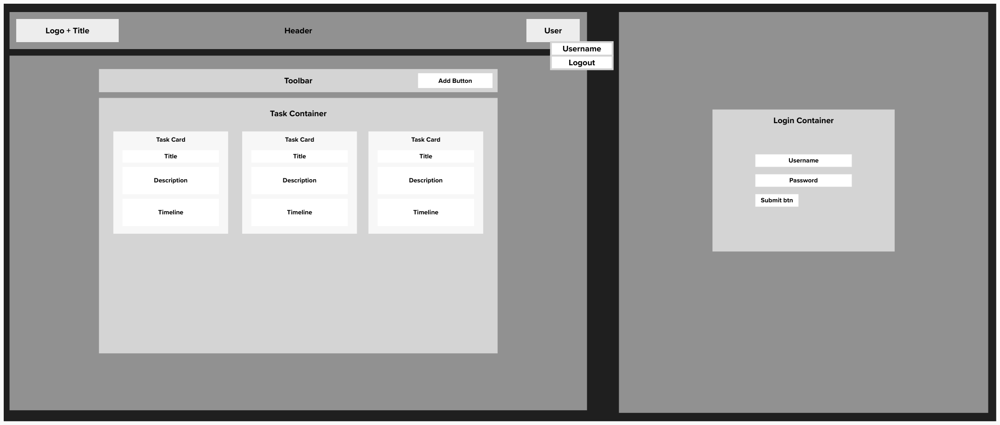

# Associate Architect Coding Challenge

## 🚀 Overview
Welcome to the **Associate Architect Coding Challenge**! This challenge evaluates your ability to **design scalable, modular architectures** while handling **deferred business decisions**. The project is divided into two main parts: **backend (Spring Boot)** and **frontend (React, TypeScript, UI5 Web Components)**.

### **🎯 Challenge Objectives**
- **Encapsulate deferred decisions** (database, authentication, payment models, collaboration)
- **Ensure modularity and scalability** in both backend and frontend
- **Implement a basic task management tool**
- **Progressively adapt the system** as new business requirements emerge
- **Follow best practices for clean architecture and flexibility**

## 📂 Folder Structure
```
associate-architect-challenge/
│── backend/               # Spring Boot Backend
│── frontend/              # React Frontend
│── README.md              # Main project documentation
│── Architecture.md        # Architectural decisions and design principles
```

---

## 📜 Backend
The backend is built using **Java Spring Boot** and provides the necessary APIs for user authentication and task management.

### **📂 Folder Structure**
```
backend/
│── src/main/java/com/signavio/architect/challenge/
│   │── rest/             # REST Controllers
│   │── repository/       # Data Access Layer
│   │── services/         # Business Logic
│   │── config/           # Configurations (authentication, database, etc.)
│   │── ChallengeApplication.java  # Main Spring Boot Application
│── pom.xml               # Maven Dependencies
│── README.md             # Backend Documentation
```

### **🚀 Running the Backend**
#### 1️⃣ Build and Run
```sh
cd backend
./gradlew bootRun
```
The backend will start on **http://localhost:8080/**.

#### 2️⃣ Run Tests
```sh
./gradlew test
```

---

## 🎨 Frontend
The frontend is built using **React, TypeScript, and UI5 Web Components**. It provides the UI for user authentication and task management.

### **📂 Folder Structure**
```
frontend/
│── src/
│   │── components/
│   │   │── login/         # Login components
│   │   │── home/          # Home page
│   │   │── taskmanager/   # Task management UI
│   │── App.tsx            # Main application component
│   │── index.tsx          # Entry point
│── package.json           # Dependencies and scripts
│── README.md              # Frontend Documentation
```

### **🚀 Running the Frontend**
#### 1️⃣ Install Dependencies
```sh
cd frontend
npm install
```
#### 2️⃣ Start Development Server
```sh
npm start
```
Frontend will be available at **http://localhost:3000/**.

#### 3️⃣ Run Tests
```sh
npm run test
```

---

## 🎯 Scenario


A growing startup wants to build a Task Management Tool that allows users to manage their tasks efficiently. The tool should be scalable, adaptable, and future-proof while meeting current requirements. The company has an agile mindset, and business needs may change frequently, requiring flexible architectural decisions.

Your challenge is to design and implement a foundational architecture that accommodates these evolving needs while maintaining system performance, security, and maintainability.

### Key Requirements
#### Core Features (MVP)
- Users can create, edit, and delete tasks.
- Tasks contain title, description, create and finished date.
- User authentication is required (Username/Password with Sessions).

#### Architectural Uncertainties (Your Design Decisions Matter!)
- The collaboration model for tasks is not fully defined yet.
- The authentication approach should work for now but may need adjustments in the future.
- The database structure must be chosen carefully, considering potential growth.
- The user model and access control could change as the product evolves.
- The frontend architecture should allow for future feature expansion.

### Your Task
Implementation:
- Backend: Implement a lightweight backend (Java) with a simple API for task management.
- Database: Design the data model while keeping potential changes in mind.
- Frontend: Build a prototype using React that consumes the backend API.
- Provide an architecture diagram outlining your solution.
- Suggest a CI/CD strategy for deploying the system.
---

## 📜 Submission Instructions
1️⃣ **Push your implementation to the provided GitHub repository**.
2️⃣ **Include the following documentation:**
   - **Architecture.md**: Explain your design decisions.
---

## 🔍 Evaluation Criteria
✅ **Software Architecture** - Encapsulation, modularity, scalability.  
✅ **Implementation** - Code quality, maintainability, best practices.  
✅ **Communication** - Clear documentation & justification of decisions.  
✅ **Handling Change** - Ability to adapt the system to new requirements.  
✅ **Scalability & Extensibility** - Readiness for future expansion.  

---
🚀 **Good luck! We’re excited to see your approach!** 🎯
